<p align="center">
  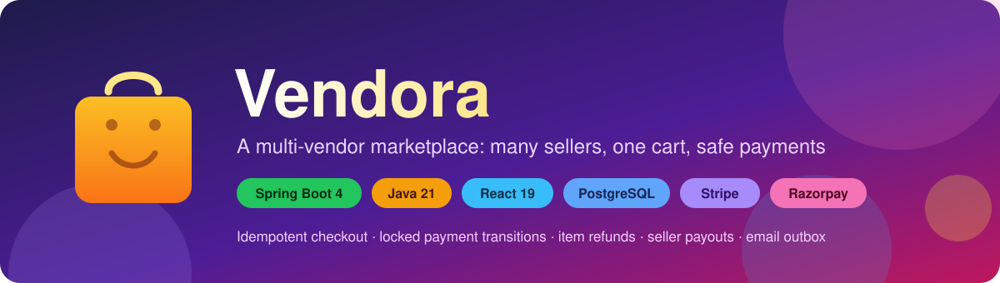
</p>

<p align="center">
  <a href="https://github.com/imrahulkr/ecomProject/actions/workflows/ci.yml"></a>
  
  
  
  
  
  
  
  
  
</p>

<p align="center">
  <b>Vendora</b> is a full-stack, multi-vendor e-commerce platform.<br/>
  Customers buy from many sellers in one cart, sellers run their own catalogue and fulfilment,<br/>
  and admins run the marketplace. Money moves safely: every payment, refund and payout is idempotent and race-free.
</p>

---

## 📑 Table of contents

1. [Highlights](#-highlights)
2. [Who uses it](#-who-uses-it)
3. [Feature tour](#-feature-tour)
4. [Tech stack](#-tech-stack)
5. [Architecture](#-architecture)
6. [Core flows (diagrams)](#-core-flows)
   - [Authentication](#1-authentication-and-session-refresh)
   - [Checkout](#2-checkout-and-stock-reservation)
   - [Payment confirmation](#3-payment-confirmation-and-reconciliation)
   - [State machines](#4-state-machines)
   - [Refunds and seller payouts](#5-refunds-and-seller-payouts)
   - [Email outbox](#6-email-delivery-transactional-outbox)
7. [Data model](#-data-model)
8. [Project structure](#-project-structure)
9. [Getting started](#-getting-started)
10. [Configuration](#-configuration)
11. [API overview](#-api-overview)
12. [Testing and CI](#-testing-and-ci)
13. [Security](#-security)
14. [Troubleshooting](#-troubleshooting)
15. [Roadmap and known gaps](#-roadmap-and-known-gaps)
16. [Further documentation](#-further-documentation)

---

## ✨ Highlights

| | |
| --- | --- |
| 🛒 **Multi-vendor cart** | One cart and one payment; each item belongs to its seller and is fulfilled, refunded and paid out separately. |
| 🔁 **Idempotent checkout** | Every checkout carries an `Idempotency-Key`, so double-clicks and network retries never create two orders. |
| 📦 **No overselling** | Stock is taken with one conditional `UPDATE … WHERE quantity >= n` and held for 10 minutes while the customer pays. |
| 💳 **Two payment providers** | Stripe and Razorpay behind one `PaymentProvider` interface, with automatic failover to the healthier provider. |
| 🔒 **Race-free money** | Webhook, poller, cancel and expiry all go through one class that locks the order row (`SELECT … FOR UPDATE`). |
| 🛟 **Self-healing payments** | Missed webhooks are recovered by polling the provider; a payment that lands on a cancelled order is refunded automatically. |
| ↩️ **Returns and item refunds** | Pro-rata refunds after coupons, exact to the paisa, retried until they succeed. |
| 💰 **Seller ledger and payouts** | An append-only ledger (sale, 10% commission, reversals); admins pay out only earnings past the return window. |
| ✉️ **Reliable email** | A transactional outbox with `FOR UPDATE SKIP LOCKED`: emails are sent only for committed changes, with retries. |
| 🛡️ **Hardened auth** | 10-minute JWT + rotating refresh cookie with reuse detection, OAuth2 (Google/GitHub), rate limits and lockout. |

---

## 👥 Who uses it

<p align="center">
  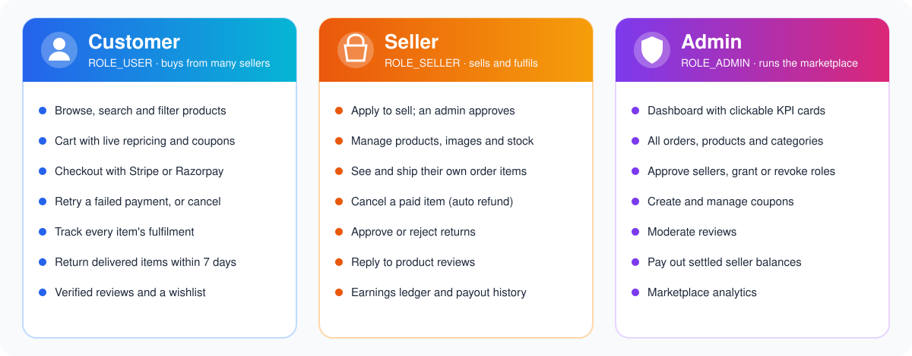
</p>

<p align="center">
  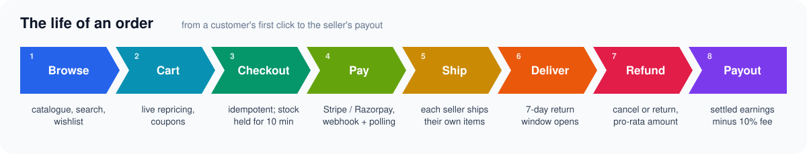
</p>

---

## 🧭 Feature tour

<details open>
<summary><b>🛍️ Storefront (customer)</b></summary>

- Product catalogue with categories, keyword search, sorting and pagination.
- Product page with images, discount price, verified-buyer reviews and a rating summary.
- Wishlist, saved addresses, account settings and linked OAuth accounts.
- Cart with live repricing (a seller's price change updates open carts), coupons, and shipping shown before checkout (₹49, free from ₹499).
- Checkout with Stripe (card, in-page Elements) or Razorpay; retry a failed payment or cancel an unpaid order.
- Order history with per-item status, return requests within 7 days of delivery, and refund status.
</details>

<details>
<summary><b>🏪 Seller workspace</b></summary>

- Apply to become a seller; an admin approves or rejects (with email).
- Create and edit products, upload images and adjust stock (stock edits are deltas, so concurrent orders are never overwritten).
- See only their own order items; mark them shipped or delivered, cancel before shipping (auto refund), approve or reject returns.
- Reply to reviews.
- Earnings summary, full ledger and payout history.
</details>

<details>
<summary><b>🧑‍💼 Admin console</b></summary>

- Dashboard with clickable KPI cards that open pre-filtered lists.
- Manage every order, product, category and user; grant or revoke roles.
- Review seller applications, create coupons, moderate reviews.
- See every seller's available and pending balance and record payouts.
- Marketplace analytics.
</details>

<details>
<summary><b>⚙️ Platform</b></summary>

- Flyway owns the whole schema (`V0`–`V20`); Hibernate only validates it.
- Scheduled jobs: payment reconciliation (every 60 s), reservation expiry, email outbox (every 5 s) and nightly data retention.
- Swagger UI, Actuator health, Docker images, Docker Compose stack with Mailpit, GitHub Actions CI.
</details>

---

## 🧰 Tech stack

| Layer | Technology |
| --- | --- |
| **Backend** | Java 21, Spring Boot 4.0 (Web MVC, Security, Data JPA, Validation, Thymeleaf, Mail, OAuth2 Client, Actuator) |
| **Persistence** | PostgreSQL 16, Hibernate (`ddl-auto=validate`), Flyway migrations, `pg_trgm` search index |
| **Auth** | JJWT (HS-signed access tokens), rotating refresh tokens, Spring OAuth2 (Google, GitHub) |
| **Payments** | `stripe-java` 32, `razorpay-java` 1.4 |
| **Resilience** | Bucket4j + Caffeine (rate limiting), transactional email outbox, idempotency keys, scheduled reconciliation |
| **Email** | Thymeleaf templates; Resend, SMTP (Mailpit locally) or a no-op provider in tests |
| **Frontend** | React 19, TypeScript, Vite 8, Tailwind CSS v4, TanStack Query, React Router, zustand, react-hook-form + zod, Stripe Elements |
| **Quality** | JUnit 5 + Mockito, Testcontainers, Vitest, oxlint, GitHub Actions |
| **Delivery** | Multi-stage Dockerfiles (Spring Boot + nginx), Docker Compose |

---

## 🏗️ Architecture

<p align="center">
  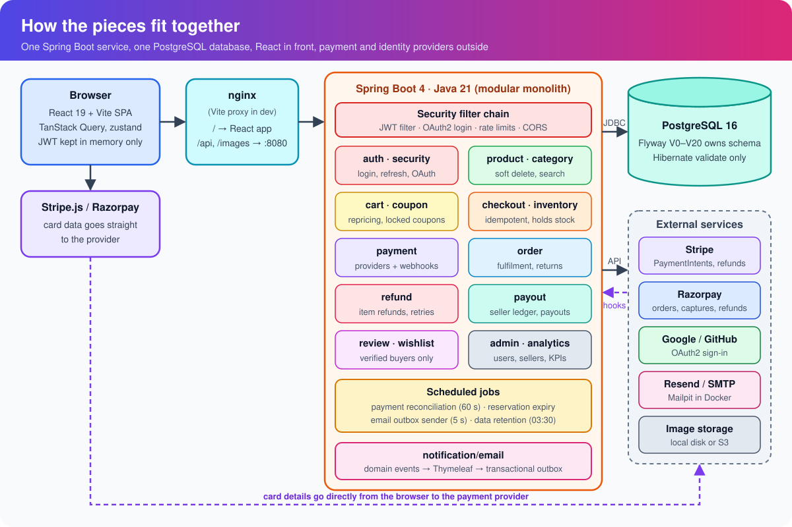
</p>

Vendora is a **modular monolith**. The code is organised by business domain (`auth/`, `product/`, `cart/`, `checkout/`, `payment/`, `order/`, `refund/`, `payout/` and so on), not by technical layer. Each package holds its entity, repository, service, controller and DTOs.

Two rules shape almost every design decision:

> **1. Never hold a database transaction open across a network call.** Stripe, Razorpay and email calls always run *after* the database work has committed.
>
> **2. Every change to an order's payment state locks the order row first.** Webhooks, the poller, customer cancels and hold expiry can run at the same moment without overwriting each other.

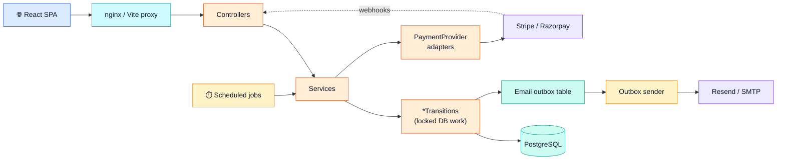

---

## 🔄 Core flows

> Colour key used in the diagrams below: 🟦 client · 🟧 backend · 🟩 database / success · 🟪 external provider · 🟨 retry or background job · 🟥 failure or money going back.

### 1. Authentication and session refresh

Short-lived access tokens (10 min) live **in memory only**. A 7-day refresh token lives in an `HttpOnly` cookie scoped to `/api/auth`, **rotates on every use**, and is stored only as a SHA-256 hash. Re-presenting an already-rotated token revokes the whole login chain.

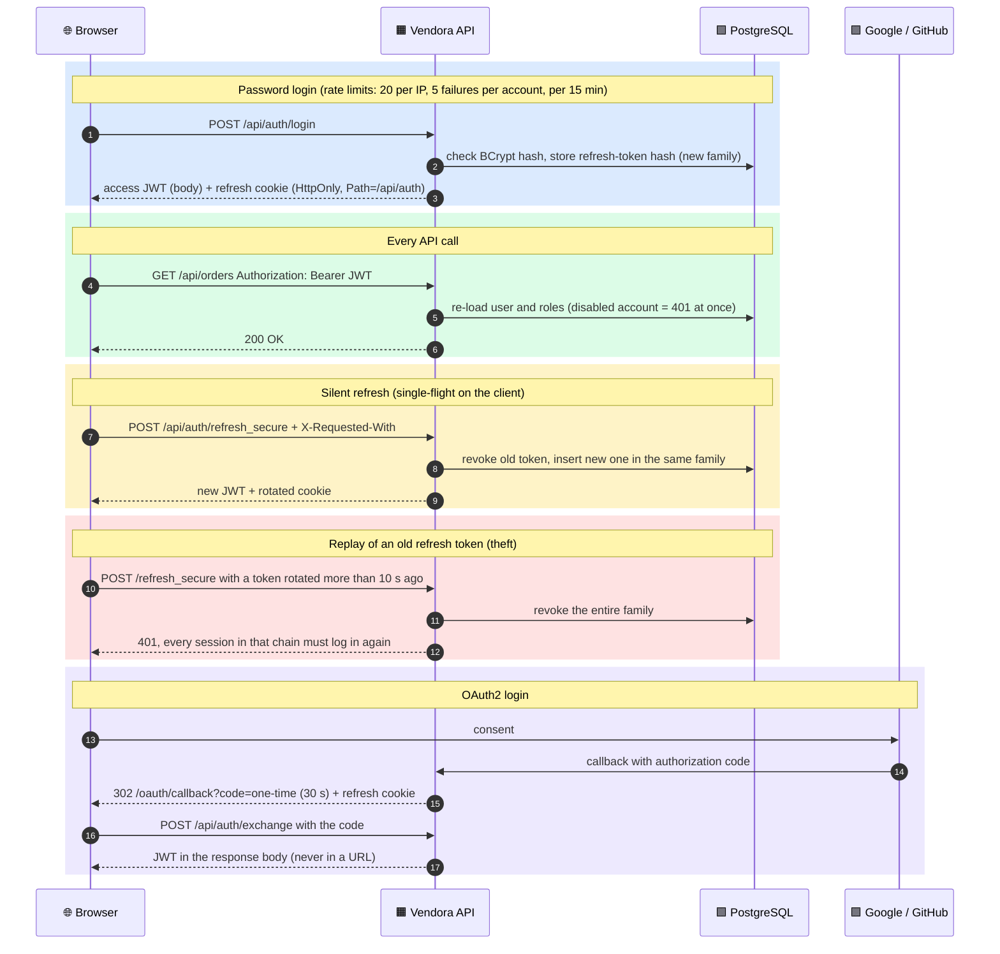

### 2. Checkout and stock reservation

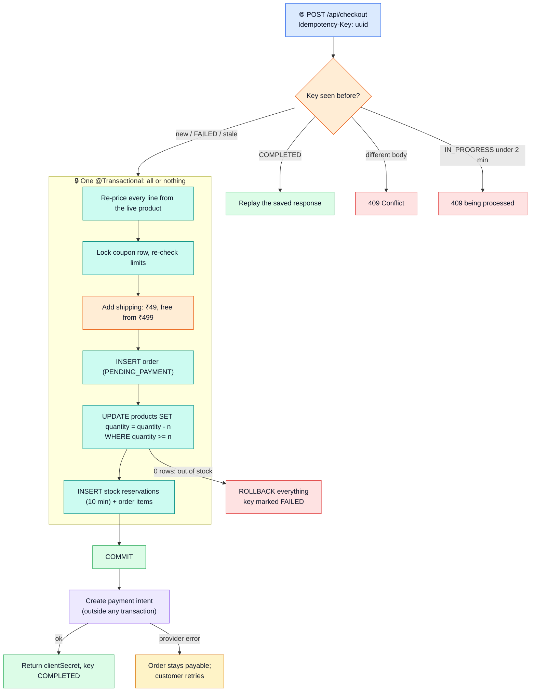

### 3. Payment confirmation and reconciliation

A payment result can reach Vendora in **three** ways. All three end in the same locked transition, so a duplicate can never apply twice.

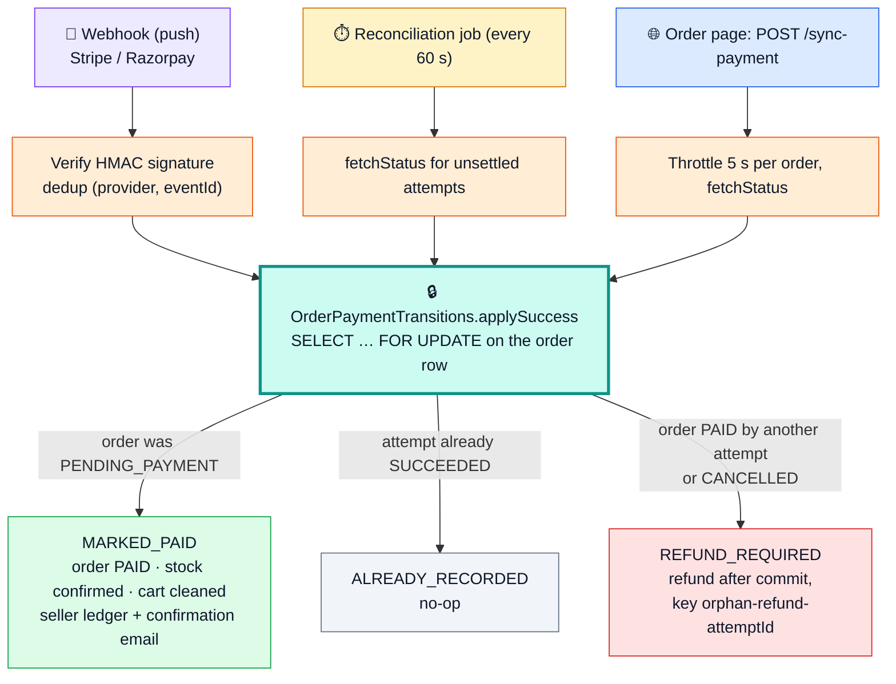

### 4. State machines

<table>
<tr>
<td width="50%" valign="top">

**Order**

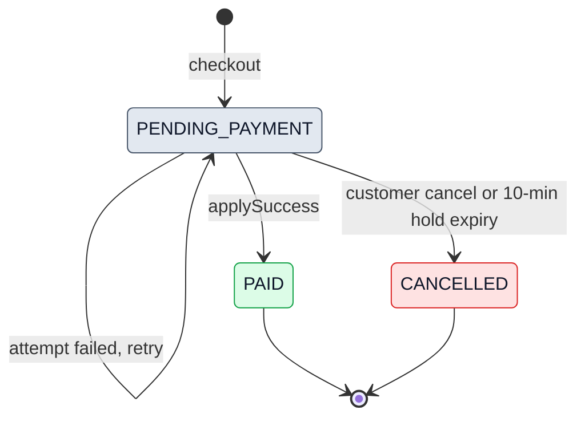

</td>
<td width="50%" valign="top">

**Payment attempt**

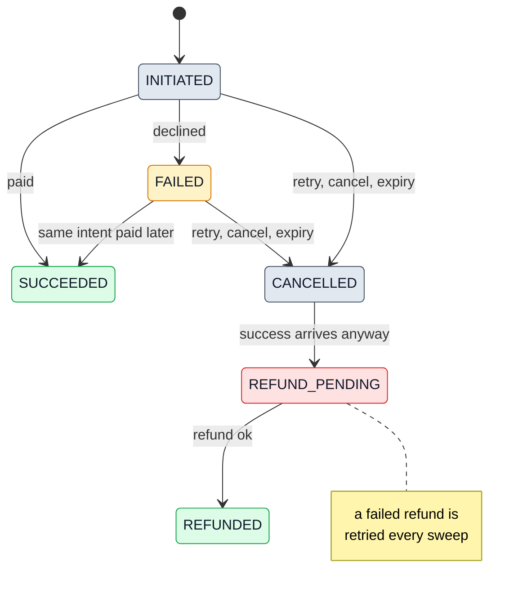

</td>
</tr>
</table>

**Order item (fulfilment, per seller)**

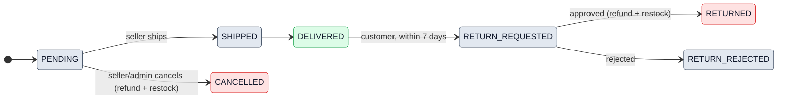

### 5. Refunds and seller payouts

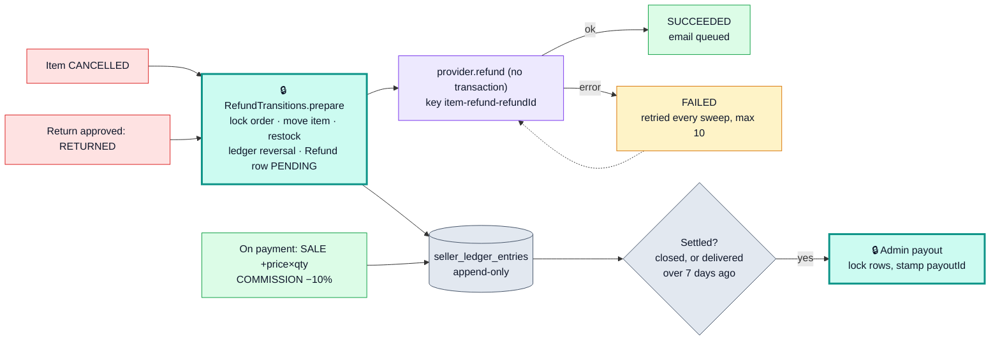

**Refund amount, worked example** (all maths in paise):

| Line | Amount |
| --- | --- |
| Item A ₹300 + Item B ₹100 | ₹400 |
| Coupon 10 % | −₹40 → goods paid ₹360 |
| Shipping (below ₹499) | +₹49 |
| **Charged** | **₹409** |
| Refund A first: 300 / 400 × 360 | **₹270** |
| Refund B last: remaining balance | **₹139** (₹90 goods + ₹49 shipping) |

The last item refunded on an order takes the remaining balance, so a fully refunded order always comes back to the exact paisa.

### 6. Email delivery (transactional outbox)

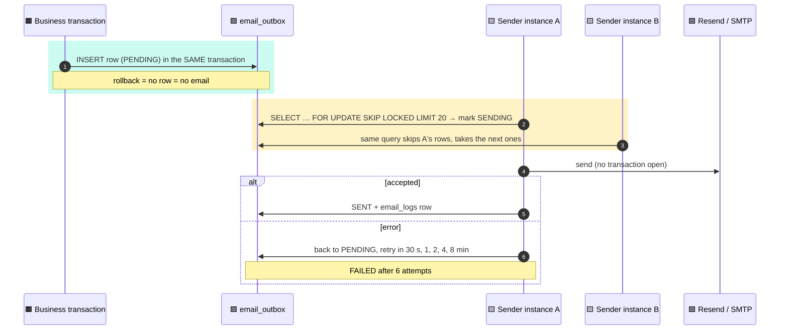

---

## 🗄️ Data model

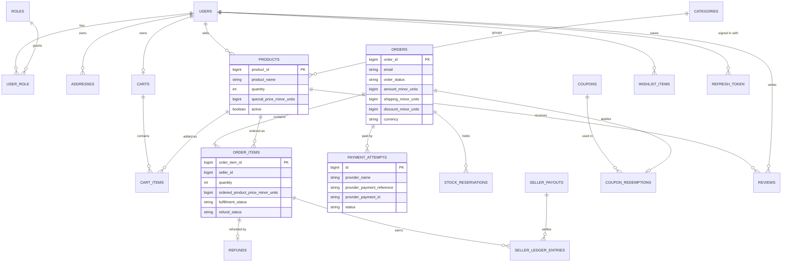

Supporting tables: `idempotency_records`, `processed_webhook_event`, `email_outbox`, `email_logs`, `provider_health`, `oauth_accounts`, `password_reset_tokens`, `verification_token`, `seller_applications`, `payments` (legacy, unused).

> 💡 **Money is always an integer number of minor units** (`long`, e.g. paise) with a `currency` column beside it. Never `double`.

---

## 📁 Project structure

```text
ecomProject/
├── src/main/java/com/ecommerce/project/
│   ├── auth/            users, roles, signup, email verification, password reset
│   ├── security/        SecurityConfig, JWT filter, refresh tokens, OAuth2 handlers
│   ├── product/         catalogue, soft delete, atomic stock updates
│   ├── category/        categories
│   ├── cart/            cart, repricing, totals
│   ├── coupon/          coupons and redemptions
│   ├── address/         customer addresses
│   ├── checkout/        checkout, idempotency, payment transitions, reconciliation job
│   ├── inventory/       stock reservations and expiry
│   ├── payment/         PaymentProvider, Stripe & Razorpay adapters, webhooks, dedup
│   ├── order/           orders, items, fulfilment, returns
│   ├── refund/          item refunds and retries
│   ├── payout/          seller ledger and payouts
│   ├── review/          reviews, replies, moderation
│   ├── wishlist/        wishlist
│   ├── seller/          seller applications
│   ├── admin/           admin endpoints
│   ├── analytics/       admin analytics
│   ├── notification/    email events, templates, outbox
│   └── housekeeping/    nightly data retention
├── src/main/resources/
│   ├── db/migration/    Flyway V0 … V20
│   ├── templates/email/ Thymeleaf email templates
│   └── application*.properties(.example)
├── src/test/            Mockito unit tests + Testcontainers integration test
├── frontend/            React 19 + Vite app (pages/store, account, seller, admin)
├── db/demo-seed.sql     optional demo users, products and categories
├── docs/                codebase audit, README images
├── Dockerfile           backend image (prod profile)
├── docker-compose.yml   Postgres + backend + nginx frontend + Mailpit
└── .github/workflows/ci.yml
```

---

## 🚀 Getting started

### Prerequisites

| Tool | Version |
| --- | --- |
| JDK | 21 |
| Node.js | 22 |
| PostgreSQL | 16 (or use Docker) |
| Docker | optional, for the one-command stack |
| Stripe CLI | optional, to forward webhooks locally |

### Option A: everything in Docker 🐳

```bash
cp .env.example .env           # set APP_JWT_SECRET (openssl rand -base64 64) and Stripe TEST keys
docker compose up --build
```

| URL | What |
| --- | --- |
| http://localhost:8081 | Storefront (nginx serves React and proxies `/api`) |
| http://localhost:8025 | Mailpit inbox: every email the app sends |

Flyway creates the schema on first start.

### Option B: run locally for development 💻

**1. Database**

```bash
createdb ecommerce            # or: docker run -p 5432:5432 -e POSTGRES_PASSWORD=postgres postgres:16-alpine
```

**2. Backend** (port `8080`)

```bash
cp src/main/resources/application-test.properties.example \
   src/main/resources/application-test.properties
# fill in DB credentials, app.jwt.secret, Stripe/Razorpay test keys

./mvnw spring-boot:run          # Windows: mvnw.cmd spring-boot:run
```

The default profile is `test`, which uses a no-op email provider, so no real emails are sent.

**3. Frontend** (port `5176`)

```bash
cd frontend
cp .env.example .env.local      # set VITE_STRIPE_PUBLISHABLE_KEY=pk_test_...
npm install
npm run dev
```

Open http://localhost:5176. Vite proxies `/api` and `/images` to the backend.

**4. Demo data (optional)**

```bash
psql -U postgres -d ecommerce -f db/demo-seed.sql
```

| Role | Email | Password |
| --- | --- | --- |
| Admin | `admin@demo.test` | `Admin@1234` |
| Seller | `seller@demo.test` | `Seller@1234` |
| Customer | `customer@demo.test` | `Customer@1234` |

**5. Stripe webhooks (optional)**

Payments are confirmed even without webhooks (the order page and the reconciliation job poll Stripe). For instant updates:

```bash
stripe listen --forward-to localhost:8080/api/payments/webhooks/stripe
# copy the printed whsec_... into stripe.webhook.secret
```

Test card: `4242 4242 4242 4242`, any future date, any CVC.

---

## 🔧 Configuration

Real secrets live only in gitignored files (`application-test.properties`, `application-prod.properties`, `frontend/.env.local`, `.env`). The `.example` files are templates.

| Setting | Default | Purpose |
| --- | --- | --- |
| `SPRING_PROFILES_ACTIVE` | `test` | `test` locally (no-op email), `prod` in Docker |
| `app.jwt.access-token-ttl-minutes` | `10` | Access token lifetime |
| `app.jwt.refresh-token-ttl-days` | `7` | Refresh cookie lifetime |
| `inventory.reservation.ttl-minutes` | `10` | How long checkout holds stock |
| `app.shipping.fee-minor-units` | `4900` | ₹49 shipping |
| `app.shipping.free-threshold-minor-units` | `49900` | Free shipping from ₹499 |
| `app.marketplace.commission-percent` | `10` | Commission on each seller sale |
| `app.returns.window-days` | `7` | Return window after delivery |
| `payment.reconciliation.interval-ms` | `60000` | Payment poller interval |
| `app.email.outbox.poll-interval-ms` | `5000` | Email sender interval |
| `app.email.retry.max-attempts` | `6` | Email attempts before `FAILED` |
| `EMAIL_PROVIDER` | `noop` | Email backend: `resend`, `smtp` or `noop` |
| `FILE_STORAGE_PROVIDER` | `local` | Product images on disk or S3 |
| `app.retention.cron` | `0 30 3 * * *` | Nightly clean-up |

---

## 📡 API overview

Interactive docs: **http://localhost:8080/swagger-ui/index.html**. The full contract (every DTO, error shape and quirk) is in [`BACKEND_CONTRACT.md`](BACKEND_CONTRACT.md).

| Area | Main endpoints | Access |
| --- | --- | --- |
| 🔐 Auth | `POST /api/auth/signup` · `login` · `refresh_secure` · `logout_secure` · `exchange` · `forgot-password` · `reset-password` | public |
| 🛍️ Catalogue | `GET /api/public/products` · `/public/products/{id}` · `/public/categories/{id}/products` · `/public/products/keyword/{kw}` | public |
| 🛒 Cart | `GET/POST /api/carts` · `PUT /api/carts/products/{id}/quantity/{op}` · `POST /api/carts/coupon/{code}` | user |
| 📍 Addresses | `GET/POST /api/addresses` · `PUT/DELETE /api/addresses/{id}` | user |
| 💳 Checkout | `POST /api/checkout` · `/{orderId}/retry-payment` · `/{orderId}/sync-payment` | user |
| 📦 Orders | `GET /api/orders` · `/orders/{id}` · `DELETE /orders/{id}` (cancel) · `POST /orders/{id}/items/{itemId}/return` | user |
| ⭐ Reviews / wishlist | `POST /api/products/{id}/reviews` · `GET /api/wishlist` | user |
| 🏪 Seller | `/api/seller/products` · `/seller/orders` · `/seller/order-items/{id}/fulfillment` · `/seller/payouts/*` | seller |
| 🧑‍💼 Admin | `/api/admin/orders` · `/admin/products` · `/admin/users` · `/admin/coupons` · `/admin/seller-applications` · `/admin/payouts` | admin |
| 🔔 Webhooks | `POST /api/payments/webhooks/stripe` · `/razorpay` (signature-verified) | provider |
| ❤️ Health | `GET /actuator/health` | public |

---

## 🧪 Testing and CI

```bash
./mvnw test                                   # unit tests + integration test
./mvnw test -Dtest=RefundTransitionsTest      # one class

cd frontend
npm run lint && npm run typecheck && npm test && npm run build
```

| Suite | What it covers |
| --- | --- |
| **Unit tests** (Mockito) | Payment transitions, reconciliation, refund maths, seller ledger, shipping, reviews, rate limits |
| **`PlatformIntegrationTest`** | Testcontainers PostgreSQL → Flyway from `V0` → Hibernate `validate` → real HTTP checkout with Stripe mocked. Skips itself if Docker isn't running. |
| **Frontend** | oxlint, `tsc`, Vitest |

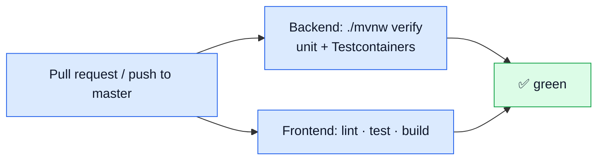

---

## 🛡️ Security

- **Tokens:** 10-minute JWT in memory; 7-day rotating refresh cookie (`HttpOnly`, `Secure`, `Path=/api/auth`) stored as a SHA-256 hash; reuse detection revokes the whole chain.
- **Instant revocation:** every request re-reads the user, so disabling an account or removing a role takes effect at once. Password change or reset signs out every session.
- **CSRF:** the API uses bearer headers; the two cookie endpoints require `X-Requested-With`, which forces a CORS preflight.
- **Rate limiting:** login (per IP and per account, with lockout), signup and password reset. Returns `429` with `Retry-After`.
- **OAuth2:** Google and GitHub, with account linking; the JWT is handed over through a 30-second one-time code, never a URL.
- **Ownership checks:** customers only see their own addresses, carts and orders; sellers only their own products and items.
- **Payments:** card data never touches the server (Stripe Elements / Razorpay Checkout); webhooks are signature-verified and de-duplicated.
- **Secrets:** never committed; the Docker image ships placeholder config only.

---

## 🩺 Troubleshooting

| Symptom | Cause and fix |
| --- | --- |
| Order says *awaiting payment* but Stripe says *succeeded* | No webhook reached your machine. The order page syncs automatically within seconds; for instant updates run `stripe listen` (see above). |
| `Failed to fetch dynamically imported module` in the browser | Vite's dependency cache is stale. Stop the dev server, delete `frontend/node_modules/.vite`, start again. |
| App fails at start-up with a schema validation error | An entity changed without a Flyway migration. Add `V21__….sql`; never switch to `ddl-auto=update`. |
| Saving an address fails on an old local database | Leftover columns from the old `ddl-auto=update` days (e.g. `addresses.is_default`). They now default safely; drop them by hand if you like. |
| `401` straight after login on `http://localhost` | Keep `app.cookie.secure=false` for plain-http local development. |
| Emails never arrive locally | Expected: the `test` profile uses a no-op provider. Use Docker Compose and open Mailpit at `:8025`. |

---

## 🗺️ Roadmap and known gaps

- [ ] Reserve stock in ascending product-id order to rule out deadlocks on multi-item carts.
- [ ] Release a coupon redemption when its order is cancelled.
- [ ] Reuse the configurable cookie settings in the OAuth success handler (local http).
- [ ] Move rate limits and the OAuth exchange-code store to Redis for multi-instance deploys.
- [ ] Admin screens for failed refunds and emails, with retry buttons.
- [ ] Real seller payouts through Stripe Connect / Razorpay Route.
- [ ] Partial-quantity refunds and a return-inspection step.
- [ ] Metrics (Micrometer + Prometheus) and alerts on the money-path counters.

---

## 📚 Further documentation

| Document | Contents |
| --- | --- |
| [`BACKEND_CONTRACT.md`](BACKEND_CONTRACT.md) | Every endpoint, DTO, auth flow, pagination and error format |
| [`CLAUDE.md`](CLAUDE.md) | Architecture notes and conventions for contributors |
| [`docs/codebase-audit.md`](docs/codebase-audit.md) | The audit behind the hardening work: gaps found and how each was fixed |
| [`db/demo-seed.sql`](db/demo-seed.sql) | Demo users, categories and products |

---

<p align="center">
  Built with ☕ Java, ⚛️ React and 🐘 PostgreSQL.<br/>
  If this project helped you, consider giving it a ⭐.
</p>
